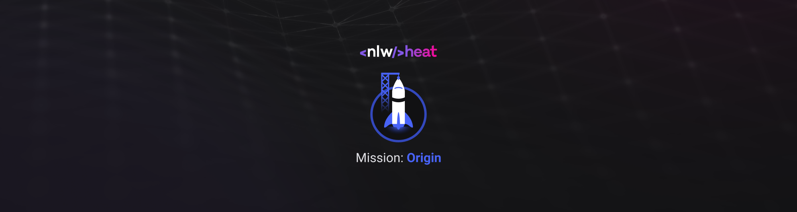

# Badge-nlw
## Virtual badge created on the Origin track on NLW Heat.


<h1 align="center">
  
</h1>

<p align="center">🚀 To view the example go to: 
<a href="https://khrissrock.github.io/Cracha-nlw/index.html"><br></a>
</p>


<p align="center">
 <a href="#goal">Goal</a> •
 <a href="#roadmap">Roadmap</a> • 
 <a href="#technologies"> Technologies </a> • 
 <a href="#license">License</a> • 
 <a href="#authors">Authors</a>
</p>


### 💻 Goal
 
 Create a virtual badge that can be changed by changing the data in the LinksSocialMedia object located in main.js, in this the main attribute is github, as this will be sent as a parameter to request from the GitHub api the data such as name, login and image of profile. The other attributes must be filled in according to the respective social networks.


### 🛠 Technologies

The following tools were used in the construction of the project:

- [CSS](https://developer.mozilla.org/pt-BR/docs/Web/CSS)
- [HTML](https://developer.mozilla.org/pt-BR/docs/Web/HTML)
- [JavaScript](https://developer.mozilla.org/pt-BR/docs/Web/JavaScript)

### Roadmap

### Prerequisites

Before starting, you will need to have the following tools installed on your machine:
A browser that supports and is enabled both JavaScript and [Git](https://git-scm.com).
Also it's nice to have an editor to work with the code like [VSCode](https://code.visualstudio.com/)


### 🎲 Running the Back End (server)

```bash
# Clone this repository
$ git clone <https://github.com/khrissrock/cracha-nlw>

# Access the project folder in the terminal/cmd
$ cd cracha-nlw

# To access VScode directly from the terminal/cmd or you can access it manually from your device
$ code

# In vscode, select the option open folder and find the directory cracha-nlw

# Find yourself and open the index.html file with your browser or, if you have installed the VScode LiveServer extension, open it with LiveServer

```
### Allocation

Codes to change the DOM of the main page are in Main.js.
Styles are in style.css
Images for social networks and backgrounds for computer and phone are in images.


### :memo: License

 

### 🦸 Authors

Gabriel Khriss :japanese_goblin: 

Jakeliny Gracielly Instructor 👨‍🚀 <a href="https://github.com/jakeliny"> See other projects here!<a>

Mayk Brito Instructor 👨‍🚀 <a href="https://github.com/maykbrito">See other projects here!<a>


Made with dedication by Gabriel Khriss 👋🏽 <a href="https://linktr.ee/khriss_gabriel">Contact!<a>
